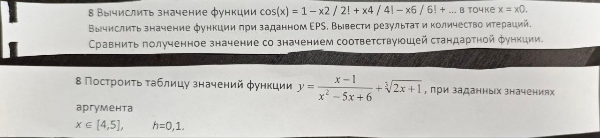

8.1 
Вычислить значение функции cos(x) = 1 - x^2/2! + x^4/4! - x^6/6! + ... в точке x = x0.
Вычислить значение функции при заданном EPS. Вывести результат и количество итераций.
Сравнить полученное значение со значением соответствующей стандартной функции.

8.2 
Построить таблицу значений функции y = (x - 1)/(x^2 - 5x + 6) + ∛(2x + 1), при заданных значениях аргумента x∈[4, 5], h = 0.1.
