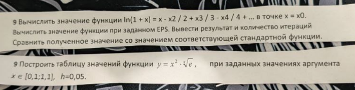

Вот текст, распознанный с изображения:

---

1. Вычислить значение функции ln(1 + x) = x - x^2 / 2 + x^3 / 3 - x^4 / 4 + ... в точке x = x0.  
Вычислить значение функции при заданном EPS. Вывести результат и количество итераций.  
Сравнить полученное значение со значением соответствующей стандартной функции.

Пояснение: Этот ряд является частным случаем степенного ряда, который сходится при ∣x∣<1∣x∣<1. Это свойство следует из анализа радиуса сходимости степенных рядов.

2. Построить таблицу значений функции \( y = x^2 \cdot \sqrt[x]{e} \), при заданных значениях аргумента \( x \in [0, 1; 1,1], h = 0,05 \).