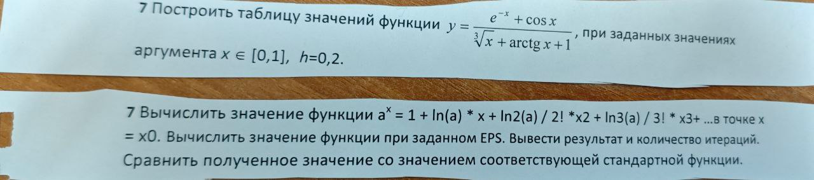

## 7.1
Построить таблицу значений функции \[y = \frac{e^{-x} + \cos(x)}{\sqrt[3]{x} + \arctan(x) + 1}\] , при заданных значениях аргумента x = [0, 1], h=0.2

## 7.2
Вычислить значение функции a^x = 1 + \ln(a) \cdot x + \frac{\ln^2(a)}{2!} \cdot x^2 + \frac{\ln^3(a)}{3!} \cdot x^3 + \cdots в точке x = x0. вычислить значения функции при заданном EPS. Вывести результат и количество итераций. Сравнить полученное значение со значением соответствующей стандартной функции